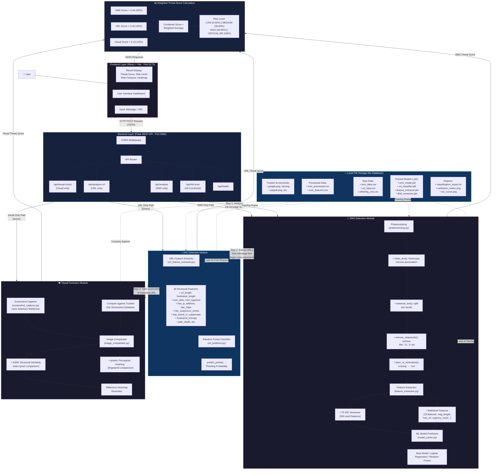
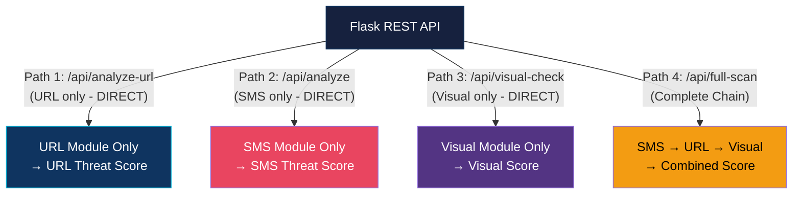

# PhishGuard AI — Complete Architecture Diagram

## Main System Architecture

```mermaid
graph TD
    %% ===== USER LAYER =====
    User["👤 User"] --> UI

    subgraph FrontendLayer["Frontend Layer (React + Vite - Port 5173)"]
        UI["User Interface Dashboard"]
        InputBox["Input: Message / URL"]
        ResultPanel["Result Display:<br/>Threat Score, Risk Level,<br/>Risk Features, Heatmap"]
        UI --> InputBox
        ResultPanel --> UI
    end

    InputBox -->|"HTTP POST Request<br/>(JSON)"| APILayer

    %% ===== API LAYER =====
    subgraph APILayer["Backend Layer (Flask REST API - Port 5000)"]
        direction TB
        CORS["CORS Middleware"]
        Router["API Router"]
        CORS --> Router
        Router --> EP1["/api/analyze<br/>(SMS only)"]
        Router --> EP2["/api/analyze-url<br/>(URL only)"]
        Router --> EP3["/api/visual-check<br/>(Visual only)"]
        Router --> EP4["/api/full-scan<br/>(All Combined)"]
        Router --> EP5["/api/health"]
    end

    %% ===== INDIVIDUAL ENDPOINT PATHS =====
    EP1 -->|"SMS Only Path"| SMSModule
    EP2 -->|"URL Only Path<br/>(Direct)"| URLModule
    EP3 -->|"Visual Only Path<br/>(Direct)"| VisualModule

    %% ===== FULL SCAN FLOW (SMS → URL → Visual) =====
    EP4 -->|"Step 1: Analyze<br/>full message text"| SMSModule

    subgraph SMSModule["📩 SMS Detection Module"]
        direction TB
        SMS1["Preprocessing<br/>(preprocessing.py)"]
        SMS1a["• clean_text(): lowercase,<br/>  remove punctuation"]
        SMS1b["• tokenize_text(): split<br/>  into words"]
        SMS1c["• remove_stopwords(): remove<br/>  'the', 'is', 'a' etc."]
        SMS1d["• stem_or_lemmatize():<br/>  'running' → 'run'"]
        SMS2["Feature Extraction<br/>(feature_extraction.py)"]
        SMS2a["• TF-IDF Vectorizer<br/>  (500 word features)"]
        SMS2b["• Statistical Features<br/>  (19 features: msg_length,<br/>  has_url, urgency_count...)"]
        SMS3["ML Model Prediction<br/>(model_cache.py)"]
        SMS3a["Best Model: Logistic<br/>Regression / Random Forest"]

        SMS1 --> SMS1a --> SMS1b --> SMS1c --> SMS1d
        SMS1d --> SMS2
        SMS2 --> SMS2a
        SMS2 --> SMS2b
        SMS2a --> SMS3
        SMS2b --> SMS3
        SMS3 --> SMS3a
    end

    SMSModule -->|"Step 2: Extract URLs<br/>from message text<br/>(regex auto-extraction)"| URLModule

    subgraph URLModule["🔗 URL Detection Module"]
        direction TB
        URL1["URL Feature Extractor<br/>(url_feature_extractor.py)"]
        URL1a["30 Structural Features:<br/>• url_length, hostname_length<br/>• num_dots, num_hyphens<br/>• has_ip_address, has_https<br/>• has_suspicious_words<br/>• has_brand_in_subdomain<br/>• hostname_entropy<br/>• path_depth, etc."]
        URL2["Random Forest Classifier<br/>(url_predictor.py)"]
        URL2a["predict_proba() →<br/>Phishing Probability"]

        URL1 --> URL1a --> URL2 --> URL2a
    end

    URLModule -->|"Step 3: Take screenshot<br/>of extracted URL"| VisualModule

    subgraph VisualModule["👁️ Visual Forensics Module"]
        direction TB
        VIS1["Screenshot Capturer<br/>(screenshot_capturer.py)<br/>Uses Selenium WebDriver"]
        VIS2["Image Comparator<br/>(image_comparator.py)"]
        VIS2a["• SSIM: Structural Similarity<br/>  Index (pixel comparison)"]
        VIS2b["• pHash: Perceptual Hashing<br/>  (fingerprint comparison)"]
        VIS3["Difference Heatmap<br/>Generator"]
        VIS4["Compare against Trusted<br/>Site Screenshot Database"]

        VIS1 --> VIS2
        VIS4 --> VIS2
        VIS2 --> VIS2a
        VIS2 --> VIS2b
        VIS2a --> VIS3
        VIS2b --> VIS3
    end

    %% ===== SCORING =====
    SMSModule -->|"SMS Threat Score"| Scoring
    URLModule -->|"URL Threat Score"| Scoring
    VisualModule -->|"Visual Threat Score"| Scoring

    subgraph Scoring["📊 Weighted Threat Score Calculation"]
        W1["SMS Score × 0.40 (40%)"]
        W2["URL Score × 0.45 (45%)"]
        W3["Visual Score × 0.15 (15%)"]
        Combine["Combined Score =<br/>Weighted Average"]
        Risk["Risk Level:<br/>LOW (0-30%) | MEDIUM (30-60%)<br/>HIGH (60-85%) | CRITICAL (85-100%)"]

        W1 --> Combine
        W2 --> Combine
        W3 --> Combine
        Combine --> Risk
    end

    Scoring -->|"JSON Response"| ResultPanel

    %% ===== LOCAL STORAGE =====
    subgraph Storage["📂 Local File Storage (No Database)"]
        direction TB
        Raw["Raw Data:<br/>• sms_data.csv<br/>• url_data.csv<br/>• phishing_urls.csv"]
        Processed["Processed Data:<br/>• sms_processed.csv<br/>• sms_features.csv"]
        Models["Trained Models (.pkl):<br/>• sms_model.pkl<br/>• url_classifier.pkl<br/>• feature_extractor.pkl<br/>• tfidf_vectorizer.pkl"]
        Trusted["Trusted Screenshots:<br/>• google.png, sbi.png<br/>• paypal.png, etc."]
        Reports["Reports:<br/>• classification_report.txt<br/>• confusion_matrix.png<br/>• roc_curve.png"]
    end

    Raw -.->|"Training Phase"| SMSModule
    Raw -.->|"Training Phase"| URLModule
    Models -.->|"Load at Startup"| SMS3
    Models -.->|"Load on First Request"| URL2
    Trusted -.->|"Compare Against"| VIS4

    %% ===== STYLING =====
    style FrontendLayer fill:#1a1a2e,stroke:#e94560,color:#fff
    style APILayer fill:#16213e,stroke:#0f3460,color:#fff
    style SMSModule fill:#1a1a2e,stroke:#e94560,color:#fff
    style URLModule fill:#0f3460,stroke:#00b4d8,color:#fff
    style VisualModule fill:#1a1a2e,stroke:#533483,color:#fff
    style Scoring fill:#16213e,stroke:#f39c12,color:#fff
    style Storage fill:#0f3460,stroke:#2ecc71,color:#fff
```

## Two Paths Explained

```mermaid
flowchart TB
    API["Flask REST API"]

    API -->|"Path 1: /api/analyze-url<br/>(URL only - DIRECT)"| URL2["URL Module Only<br/>→ URL Threat Score"]
    API -->|"Path 2: /api/analyze<br/>(SMS only - DIRECT)"| SMS2["SMS Module Only<br/>→ SMS Threat Score"]
    API -->|"Path 3: /api/visual-check<br/>(Visual only - DIRECT)"| VIS2["Visual Module Only<br/>→ Visual Score"]
    API -->|"Path 4: /api/full-scan<br/>(Complete Chain)"| FULL["SMS → URL → Visual<br/>→ Combined Score"]

    style API fill:#16213e,stroke:#0f3460,color:#fff
    style URL2 fill:#0f3460,stroke:#00b4d8,color:#fff
    style SMS2 fill:#e94560,color:#fff
    style VIS2 fill:#533483,color:#fff
    style FULL fill:#f39c12,color:#000
```

## Full Scan Flow (SMS → URL → Visual Chain)

```mermaid
flowchart LR
    A["User types message:<br/>'Visit http://phish.com<br/>to verify account'"] --> B["SMS Module<br/>analyzes full<br/>message text"]
    B -->|"Extracts URL<br/>from message"| C["URL Module<br/>analyzes<br/>http://phish.com"]
    C -->|"Takes screenshot<br/>of URL"| D["Visual Module<br/>compares screenshot<br/>vs trusted sites"]
    D --> E["Combine Scores:<br/>SMS 40% + URL 45%<br/>+ Visual 15%"]
    E --> F["Final Result:<br/>Threat Score &<br/>Risk Level"]

    style A fill:#1a1a2e,stroke:#e94560,color:#fff
    style B fill:#e94560,color:#fff
    style C fill:#0f3460,color:#fff
    style D fill:#533483,color:#fff
    style E fill:#f39c12,color:#000
    style F fill:#2ecc71,color:#fff
```
